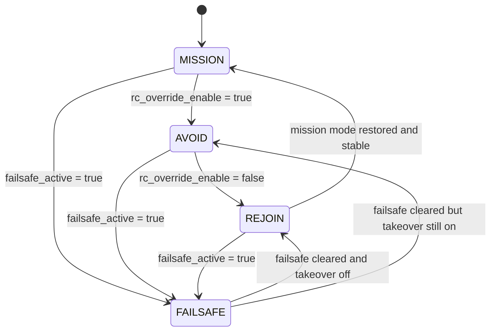

# Architecture Overview — SEANO Collision Avoidance
## Arsitektur aktif untuk Simulation Baseline dan Hardware Baseline

Dokumen ini menjelaskan arsitektur runtime aktif dari modul collision avoidance SEANO pada dua baseline yang saat ini dipakai:

- **Simulation baseline**
  SITL + Mission Planner + MAVROS + `phase5_mission_avoid_integration.launch.py`

- **Hardware baseline**
  Jetson + CUAV X7+ + USB camera + MAVROS + `phase7_cuav_usb_hardware.launch.py`

Dokumen ini menggantikan cara pandang lama yang hanya berfokus pada:
- simulasi WSL2,
- synthetic camera,
- Phase 5 / Phase 6 sebagai satu-satunya baseline aktif.

Sekarang arsitektur aktif harus dibaca sebagai:
- **simulasi** untuk validasi repeatable dan evidence extraction,
- **hardware** untuk bench integration dan field-test preparation.

---

## 1. Tujuan Arsitektur

Tujuan utama arsitektur ini adalah:

1. Menjaga **autopilot mission** tetap menjadi penggerak utama waypoint mission.
2. Memberi **lapisan collision avoidance** yang dapat mengambil alih sementara saat ada risiko.
3. Mengembalikan sistem ke mission secara formal melalui state:
   - `MISSION`
   - `AVOID`
   - `REJOIN`
   - `FAILSAFE`
4. Memisahkan lapisan:
   - perception,
   - decision,
   - control selection,
   - actuation safety,
   - autopilot mode handling,
   - monitoring,
   agar mudah diuji per lapis.
5. Menyediakan dua jalur aktif:
   - jalur simulasi yang repeatable,
   - jalur hardware yang realistis untuk integrasi Jetson + FCU + kamera.

---

## 2. Konteks Kendaraan

USV SEANO menggunakan **differential thruster** tanpa rudder.

Karena itu, antarmuka kontrol internal utama bukan rudder, tetapi:

- `left_cmd`
- `right_cmd`

Keputusan ini dipakai agar perilaku kontrol sesuai dengan fisik kendaraan:

- maju lurus: `left == right`
- belok kanan: `left > right`
- belok kiri: `right > left`

Konsekuensinya:
- jalur aktuasi internal dibangun untuk left/right command,
- bridge ke FCU bertugas menerjemahkan command ini ke RC override / PWM yang sesuai.

---

## 3. Dua Baseline Aktif

### 3.1 Simulation baseline
Dipakai untuk:
- validasi state machine,
- validasi mission -> avoid -> rejoin,
- pengujian synthetic perception,
- rosbag recording,
- Phase 6 metrics extraction.

Launch utama:
- `phase5_mission_avoid_integration.launch.py`

Karakter utama:
- repeatable,
- ringan,
- mudah direkam,
- kuat untuk evidence kuantitatif TA.

---

### 3.2 Hardware baseline
Dipakai untuk:
- validasi FCU nyata,
- validasi kamera USB nyata,
- validasi detector -> risk -> watchdog,
- validasi browser monitoring,
- bench test dan field-test preparation.

Launch utama:
- `phase7_cuav_usb_hardware.launch.py`

Karakter utama:
- realistis,
- bergantung pada kondisi perangkat,
- menuntut kestabilan perception,
- sangat sensitif pada pencahayaan, kualitas kamera, dan kondisi lapangan.

---

## 4. Arsitektur Tingkat Tinggi

```mermaid
flowchart LR

subgraph MissionLayer["Mission / Autopilot Layer"]
MP["Mission Planner / Mission Waypoints"]
SITL["ArduPilot SITL"]
HWFCU["CUAV X7+ / ArduPilot HW"]
end

subgraph PerceptionLayer["Perception / Decision Layer"]
CAM["Camera Source<br/>(Synthetic / USB)"]
DET["Detector"]
RISK["Risk Evaluator"]
WD["Watchdog / Failsafe"]
HUD["Debug HUD / Browser Monitoring"]
CAM --> DET
DET --> RISK
CAM --> WD
RISK --> WD
RISK --> HUD
CAM --> HUD
DET --> HUD
end

subgraph ControlLayer["Command / Control Layer"]
TELEOP["teleop_diff_thruster_node"]
AUTO["auto_controller_stub_node"]
MUX["command_mux_node"]
LIM["actuator_safety_limiter_node"]
BR["mavros_rc_override_bridge_node"]
TELEOP --> MUX
AUTO --> MUX
MUX --> LIM
LIM --> BR
end

subgraph ModeLayer["Mode / State Layer"]
MM["mission_mode_manager_node"]
STATE["/ca/mode_manager_state"]
EVT["/ca/mode_manager_event"]
MM --> STATE
MM --> EVT
end

subgraph EvalLayer["Evaluation Layer"]
BAG["rosbag"]
MET["Phase 6 metrics scripts"]
BAG --> MET
end

MP --> SITL
MP --> HWFCU

SITL -->|/mavros/state| MM
HWFCU -->|/mavros/state| MM

RISK -->|/ca/command_safe| AUTO
WD -->|/ca/failsafe_active| AUTO
WD -->|/ca/failsafe_active| LIM
WD -->|/ca/failsafe_active| MM

AUTO -->|/seano/rc_override_enable| MM
BR -->|/mavros/rc/override| SITL
BR -->|/mavros/rc/override| HWFCU

STATE --> BAG
EVT --> BAG
RISK --> BAG
WD --> BAG
````

---

## 5. Prinsip Integrasi Mission

Prinsip integrasi yang dipakai adalah:

* autopilot tetap menjalankan **mission waypoint** dalam mode normal,
* collision avoidance hanya melakukan **takeover sementara**,
* takeover dilakukan melalui:

  * RC override,
  * perpindahan mode ke mode avoid/failsafe yang aman,
* setelah aman:

  * override dilepas,
  * mode mission dipulihkan,
  * sistem masuk `REJOIN`,
  * setelah stabil sistem kembali ke `MISSION`.

Dengan pola ini, arsitektur aktif dibaca sebagai:

```text
MISSION -> AVOID -> REJOIN -> MISSION
```

dan saat kondisi tidak aman dari sisi sistem:

```text
MISSION / AVOID / REJOIN -> FAILSAFE
```

---

## 6. State Machine Resmi



### Makna tiap state

#### `MISSION`

* autopilot menjalankan mission normal
* mode target umumnya `AUTO`
* RC override tidak aktif

#### `AVOID`

* collision avoidance takeover aktif
* RC override aktif
* mode target avoidance aktif
* kapal keluar dari jalur nominal untuk menghindar

#### `REJOIN`

* takeover sudah dilepas
* sistem sedang mengembalikan mode mission dan menunggu stabil
* mode target umumnya `AUTO`
* state ini dipakai agar “kembali ke mission” bisa diamati dan diukur

#### `FAILSAFE`

* perception / sistem dianggap tidak aman
* mode target aman diaktifkan
* limiter / watchdog menegakkan perilaku aman
* command avoidance normal bisa ditahan atau diganti policy aman

---

## 6.1 Hierarki State yang Harus Dibaca Terpisah

Agar tidak terjadi kebingungan saat pembacaan kode, hasil uji, atau penulisan laporan, repository ini memiliki **tiga level state** yang berbeda. Ketiganya saling berkaitan, tetapi **tidak boleh disamakan**.

### a. State persepsi di `risk_evaluator_node.py`

State ini menggambarkan kesehatan dan kualitas persepsi pada level evaluator risiko:

- `NORMAL`
- `CAUTION`
- `LOST_PERCEPTION`

Maknanya:
- `NORMAL` = persepsi dianggap sehat
- `CAUTION` = persepsi masih hidup tetapi kualitas menurun, sehingga keputusan perlu dideeskalasi
- `LOST_PERCEPTION` = persepsi tidak cukup dipercaya dan command avoidance dipaksa aman

### b. State watchdog di `watchdog_failsafe_node.py`

State ini adalah state pengaman operasional watchdog:

- `NORMAL`
- `CAUTION`
- `LOST`

Maknanya:
- `NORMAL` = jalur input dianggap sehat
- `CAUTION` = jalur masih hidup tetapi tidak cukup baik untuk keputusan agresif
- `LOST` = jalur dianggap tidak layak dipercaya dan watchdog menaikkan failsafe

### c. State mission/autopilot di `mission_mode_manager_node.py`

State ini adalah state formal untuk mission handling dan autopilot mode restore:

- `MISSION`
- `AVOID`
- `REJOIN`
- `FAILSAFE`

Maknanya:
- `MISSION` = autopilot menjalankan mission normal
- `AVOID` = takeover collision avoidance aktif
- `REJOIN` = takeover sudah dilepas dan sistem sedang memulihkan mission mode secara formal
- `FAILSAFE` = sistem masuk mode aman dari sudut pandang mission/autopilot

### d. Hubungan antarketiga level state

Cara membacanya adalah sebagai berikut:

- state persepsi menentukan apakah evaluator risiko masih boleh menghasilkan keputusan normal
- state watchdog menentukan apakah jalur persepsi masih cukup sehat untuk diizinkan mengontrol avoidance
- state mission/autopilot menentukan bagaimana FCU harus dibaca pada level `MISSION / AVOID / REJOIN / FAILSAFE`

Dengan kata lain:

- `LOST_PERCEPTION` pada evaluator **bukan** nama state yang sama dengan `FAILSAFE` pada mission manager
- `LOST` pada watchdog **bukan** nama state yang sama dengan `REJOIN` atau `AVOID`
- mission manager bekerja pada level lebih tinggi, yaitu mode dan pemulihan mission

Penjelasan ini penting untuk sidang, interpretasi rosbag, dan sinkronisasi antara kode, laporan, dan jurnal.

## 7. Layer dan Tanggung Jawab

## 7.1 Mission / Autopilot Layer

Komponen:

* Mission Planner
* ArduPilot SITL
* CUAV X7+ / ArduPilot hardware

Tanggung jawab:

* memegang waypoint mission,
* menjaga navigasi utama,
* menyediakan state autopilot ke ROS melalui MAVROS.

Catatan:

* layer ini tetap menjadi “pengendali utama” jalur mission,
* sistem collision avoidance hanya menjadi **safety layer** di atasnya.

---

## 7.2 Perception / Decision Layer

Komponen yang dapat aktif:

* `camera_node`
* `detector_node`
* `waterline_horizon_node`
* `false_positive_guard_node`
* `multi_target_fusion_node`
* `vision_quality_node`
* `frame_freeze_detector_node`
* `risk_evaluator_node`
* `watchdog_failsafe_node`

Tanggung jawab:

* memperoleh image,
* mendeteksi obstacle,
* menyaring / menggabungkan detections bila perlu,
* menilai kualitas persepsi,
* mendeteksi freeze / stale,
* menghitung risk,
* menentukan command collision avoidance yang aman,
* mengeluarkan status failsafe bila perception dianggap tidak sehat.

Catatan:

* tidak semua node perception harus aktif di setiap mode uji,
* simulasi ringan biasanya memakai subset yang lebih kecil,
* hardware bench bisa menyalakan jalur yang lebih lengkap sesuai kebutuhan.

---

## 7.3 Command / Control Layer

Komponen:

* `teleop_diff_thruster_node`
* `auto_controller_stub_node`
* `command_mux_node`
* `actuator_safety_limiter_node`
* `mavros_rc_override_bridge_node`

Tanggung jawab:

* menerima command manual dan auto,
* memilih sumber command,
* membatasi output secara aman,
* menerjemahkan `left/right` ke RC override PWM.

Jalur aktuasi inti:

```text
manual/auto command
-> command_mux_node
-> actuator_safety_limiter_node
-> mavros_rc_override_bridge_node
-> /mavros/rc/override
-> ArduPilot
```

---

## 7.4 Mode / State Layer

Komponen:

* `mission_mode_manager_node`

Input utama:

* `/mavros/state`
* `/seano/rc_override_enable`
* `/ca/failsafe_active`

Output utama:

* `/ca/mode_manager_state`
* `/ca/mode_manager_event`

Tanggung jawab:

* mengelola state `MISSION / AVOID / REJOIN / FAILSAFE`,
* memutuskan target mode autopilot,
* memulihkan mode mission setelah release,
* memastikan kondisi “state = MISSION tapi mode FCU masih MANUAL” tidak dibiarkan terlalu lama.

Catatan:

* layer ini penting bukan hanya untuk kontrol,
* tapi juga untuk **evidence generation** dan interpretasi hasil uji.

---

## 7.5 Monitoring Layer

Komponen monitoring aktif:

* `/seano/camera/image_raw_reliable`
* `/camera/image_annotated`
* `/ca/debug_image`
* `web_video_server`
* browser monitoring pada laptop/operator

Tanggung jawab:

* menampilkan apa yang dilihat kamera,
* menampilkan apa yang dideteksi AI,
* menampilkan HUD keputusan sistem,
* membantu operator mendiagnosis kegagalan:

  * perception lost,
  * command aneh,
  * risk tidak berubah,
  * annotated tidak muncul,
  * HUD tidak sinkron.

Ini adalah layer yang menjadi penghubung utama antara runtime di Jetson dan observasi manusia saat bench maupun uji air.

---

## 7.6 Evaluation Layer

Komponen:

* rosbag
* `phase6_metrics_from_bag.py`
* `phase6_collect_results.py`
* helper script lain untuk pengumpulan hasil

Tanggung jawab:

* merekam event runtime,
* mengekstrak metrik,
* membandingkan antar-run,
* membangun bukti kuantitatif untuk TA.

Catatan:

* layer ini sangat kuat di simulasi,
* namun juga tetap relevan untuk hardware jika rosbag direkam saat uji nyata.

---

## 8. Node dan Tanggung Jawab Inti

### `teleop_diff_thruster_node`

Tujuan:

* manual control / low-level validation

Output:

* `/seano/manual/left_cmd`
* `/seano/manual/right_cmd`

---

### `auto_controller_stub_node`

Tujuan:

* membaca command decision lalu menerjemahkannya ke `left/right`
* menjadi jembatan antara hazard command dan takeover control

Input:

* `/ca/command_safe`
* `/ca/failsafe_active`

Output:

* `/seano/auto/left_cmd`
* `/seano/auto/right_cmd`
* `/seano/auto_enable`
* `/seano/rc_override_enable`

---

### `command_mux_node`

Tujuan:

* memilih sumber command:

  * manual
  * auto

Input:

* `/seano/manual/left_cmd`
* `/seano/manual/right_cmd`
* `/seano/auto/left_cmd`
* `/seano/auto/right_cmd`
* `/seano/auto_enable`

Output:

* `/seano/selected/left_cmd`
* `/seano/selected/right_cmd`

---

### `actuator_safety_limiter_node`

Tujuan:

* menegakkan safety policy sebelum command masuk ke autopilot

Input:

* `/seano/selected/left_cmd`
* `/seano/selected/right_cmd`
* `/ca/failsafe_active`

Output:

* `/seano/left_cmd`
* `/seano/right_cmd`

Tanggung jawab:

* stale handling
* timeout handling
* safe-stop policy
* clamp output

---

### `mavros_rc_override_bridge_node`

Tujuan:

* mengubah command `left/right` menjadi PWM RC override

Input:

* `/seano/left_cmd`
* `/seano/right_cmd`
* `/seano/rc_override_enable`

Output:

* `/mavros/rc/override`

Peran:

* jembatan aktuasi ROS 2 -> MAVROS -> ArduPilot

---

### `mission_mode_manager_node`

Tujuan:

* mengelola mode autopilot dan state machine tingkat tinggi

Peran:

* `MISSION` -> target mission mode
* `AVOID` -> target avoid mode
* `FAILSAFE` -> target failsafe mode
* `REJOIN` -> restore mode mission dan tunggu stabil

---

### `camera_node`

Tujuan:

* menyediakan raw image dari source aktif

Source yang mungkin:

* synthetic
* USB
* RTSP / legacy path bench tertentu

---

### `detector_node`

Tujuan:

* membaca image,
* menjalankan detector AI,
* mengeluarkan detections,
* menghasilkan annotated image.

---

### `risk_evaluator_node`

Tujuan:

* membaca detections,
* menghitung risk,
* menentukan command avoidance,
* menghasilkan debug HUD.

Output penting:

* `/ca/risk`
* `/ca/command`
* `/ca/debug_image`

---

### `watchdog_failsafe_node`

Tujuan:

* memonitor kesehatan jalur persepsi,
* mendeteksi kondisi lost/stale/freeze,
* mengaktifkan failsafe jika perception tidak dapat dipercaya.

Output penting:

* `/ca/failsafe_active`
* `/ca/watchdog_status`

---

## 9. Runtime Profiles Aktif

Arsitektur runtime saat ini dibedakan menjadi beberapa mode uji.

### 9.1 Simulation runtime

Fokus utama:

* `phase5_mission_avoid_integration.launch.py`

Mode yang umum:

* Case A — mode manager only
* Case B — takeover logic only
* Case C — full integration (synthetic camera)

Profile praktis:

* `synthetic_light`
* `synthetic_watchdog`
* `full`

Tujuan:

* menguji logika tanpa bergantung pada hardware nyata.

---

### 9.2 Hardware runtime

Fokus utama:

* `phase7_cuav_usb_hardware.launch.py`

Tujuan:

* menguji integrasi nyata:

  * FCU,
  * kamera,
  * detector,
  * risk,
  * watchdog,
  * control,
  * monitoring.

Hardware baseline adalah jalur yang dipakai untuk:

* dockside bench,
* AUTO without obstacle,
* obstacle run,
* field-test preparation.

---

## 10. Topic Reference Inti

| Topic                              | Peran                               |
| ---------------------------------- | ----------------------------------- |
| `/seano/manual/left_cmd`           | manual left command                 |
| `/seano/manual/right_cmd`          | manual right command                |
| `/seano/auto/left_cmd`             | auto left command                   |
| `/seano/auto/right_cmd`            | auto right command                  |
| `/seano/auto_enable`               | memilih jalur auto di mux           |
| `/seano/selected/left_cmd`         | output mux                          |
| `/seano/selected/right_cmd`        | output mux                          |
| `/seano/left_cmd`                  | final left command                  |
| `/seano/right_cmd`                 | final right command                 |
| `/seano/rc_override_enable`        | mengaktifkan RC override            |
| `/mavros/rc/override`              | RC override ke FCU                  |
| `/mavros/state`                    | mode / armed / connection state     |
| `/ca/command_safe`                 | command decision untuk takeover     |
| `/ca/risk`                         | nilai risk                          |
| `/ca/command`                      | output command CA                   |
| `/ca/mode_manager_state`           | state mission/avoid/rejoin/failsafe |
| `/ca/mode_manager_event`           | event manager                       |
| `/ca/failsafe_active`              | status failsafe                     |
| `/ca/watchdog_status`              | status watchdog                     |
| `/seano/camera/image_raw_reliable` | raw camera utama                    |
| `/camera/image_annotated`          | image dengan overlay detections     |
| `/ca/debug_image`                  | HUD / decision overlay              |

---

## 11. Arsitektur Simulasi

Arsitektur simulasi dianggap tervalidasi bila:

1. `/mavros/state connected: true`
2. state manager menunjukkan:

   * `MISSION -> AVOID -> REJOIN -> MISSION`
3. event manager menunjukkan:

   * `TAKEOVER_ON`
   * `TAKEOVER_OFF`
   * `REJOIN_START`
   * `REJOIN_DONE`
4. rosbag dapat direkam dengan baik
5. extractor metrics menghasilkan:

   * `reaction_time_s`
   * `release_time_s`
   * `rejoin_time_s`
   * `mode_mismatch.mismatch_ratio`

Simulasi adalah baseline paling kuat untuk evidence kuantitatif.

---

## 12. Arsitektur Hardware

Arsitektur hardware dianggap sehat bila:

1. FCU connect stabil melalui MAVROS
2. kamera USB menghasilkan raw image stabil
3. detector menghasilkan annotated image dan detections
4. risk evaluator aktif
5. watchdog aktif tetapi tidak salah-trigger terus-menerus
6. browser monitoring raw / annotated / HUD dapat dipakai
7. command chain aktif dari risk sampai RC override
8. AUTO mission dapat berjalan
9. obstacle run dapat menunjukkan:

   * detect
   * avoid
   * release
   * rejoin

Hardware baseline adalah jembatan menuju pembuktian collision avoidance nyata di air.

---

## 13. Phase 6 Metrics Architecture

Layer evaluasi saat ini mendukung pengukuran berbasis rosbag.

Metrik utama:

1. takeover segments
2. takeover duration
3. reaction time
4. release time
5. rejoin time
6. failsafe rises
7. mission-mode mismatch ratio

Sumber utama:

* `/ca/command_safe`
* `/seano/rc_override_enable`
* `/ca/failsafe_active`
* `/mavros/state`
* `/ca/mode_manager_state`
* `/ca/mode_manager_event`

Makna penting:

* state machine bukan hanya untuk kontrol,
* tetapi juga untuk **evidence generation**.

---

## 14. Batasan Saat Ini

Arsitektur aktif saat ini sudah mendukung:

* temporary avoidance takeover,
* release,
* rejoin,
* simulation metrics extraction,
* hardware bench integration,
* browser monitoring untuk hardware.

Namun masih ada batasan:

* return-to-path masih berorientasi **mission resume / mode restore**, belum full path replanning,
* keberhasilan hardware sangat tergantung kualitas detection,
* perception hardware masih sensitif terhadap cahaya, kontras obstacle, dan kestabilan stream,
* pembuktian field full end-to-end masih harus dijaga dengan skenario yang sederhana dan aman.

---

## 15. Arah Pengembangan Berikutnya

Tahap berikut yang paling sesuai dengan arsitektur ini:

1. membakukan baseline simulasi sebagai evidence kuantitatif utama,
2. memperkuat baseline hardware dengan `phase7`,
3. menjalankan dockside test yang repeatable,
4. membatasi field-test ke skenario obstacle sederhana dulu,
5. mengumpulkan evidence:

   * video monitoring,
   * screenshot HUD,
   * rosbag,
   * catatan hasil run,
6. setelah baseline stabil, baru audit launch lama dan refactor struktur lebih jauh.

---

## 16. Ringkasan

Arsitektur aktif SEANO sekarang harus dibaca sebagai:

* autopilot tetap menjalankan mission,
* collision avoidance mengambil alih sementara saat berbahaya,
* kontrol internal memakai `left/right`,
* limiter menjaga aktuasi tetap aman,
* mode manager mengelola `MISSION / AVOID / REJOIN / FAILSAFE`,
* simulasi dipusatkan di `phase5`,
* hardware dipusatkan di `phase7`,
* monitoring browser menjadi alat diagnosis utama pada hardware,
* rosbag metrics tetap menjadi sumber evidence kuantitatif utama.

Dengan demikian, repository ini tidak lagi hanya “simulasi Phase 5/6”, tetapi sudah menjadi sistem dengan dua baseline aktif:

* **simulation baseline**
* **hardware baseline**
